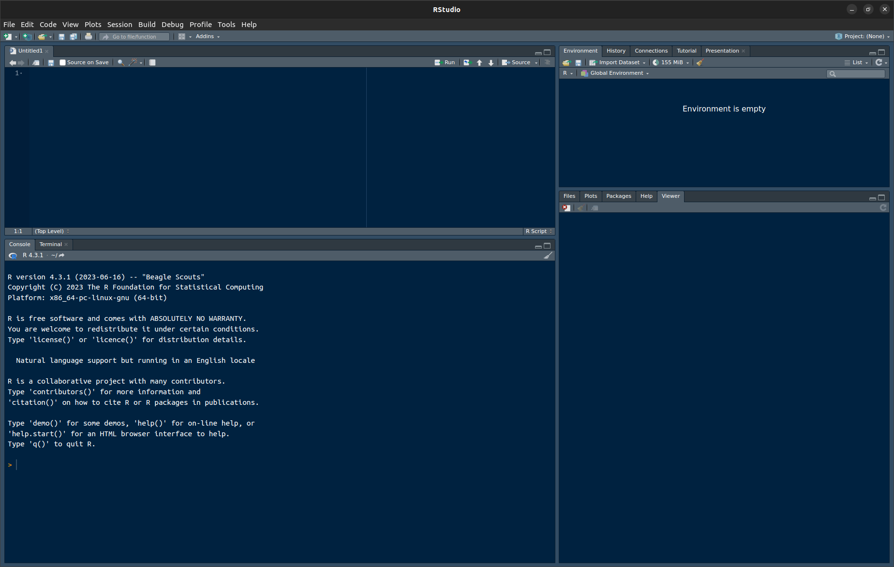

# Installing and configuring R and RStudio

## Goals

1. You'll install the software you'll need for this part of the class: `R`, `RStudio`, and `tidyverse/ggplot2`.
2. You'll tinker with the `R` and `RStudio` settings.
3. You'll draw and save your first graph, a scatterplot, to see if everything is working as it should be.

## Software

1. Download the free program `R` from https://r-project.org (Download, CRAN) and install it. In case you already had R installed before taking this course, please check that you have at least version 4.3.1.
2. Download and install the free program `RStudio`: https://posit.co/products/open-source/rstudio/. Pick the free desktop version. 
RStudio offers a tidier user interface for `R`.
3. Open `RStudio`. You should see four frames as in Figure \@ref(fig:rstudio) below. If you see only one frame on the left-hand side, click `File`, `New File`, `R Script`.

```{r rstudio, echo = FALSE, fig.cap = "RStudio. _Top left_: Script editor. This is where you can enter and edit commands and comments. _Bottom left_: R console. Commands that you copy from the script editor to this console will be evaluated by `R`. _Top right_: Here you'll find a list of the objects currently available in R's working memory (none at the moment). _Bottom right_: Plots (none at the moment), help pages etc."}

```

4. Go to `Tools > Global Options... > General.` Untick `Restore .RData into workspace at startup` and set `Save workspace to .RData on exit` to `Never`. This way, you'll start with a clean slate each time you restart `R`, i.e., there won't be any objects in the workspace from a previous session that could affect your computations in the current session. This, in turn, will help ensure that when other people run the same code as you, the results will be the same, too.

5. Go to `Tools > Global Options...> Code > Saving`. Set `Default text encoding` to `UTF-8`.

6. Go to `Tools > Global Options...> Code > Editing`. Tick `Use native pipe operator. |>`.

7. Enter the following line into the script editor (top left). Brackets, quotation marks, capitalisation, and the like all matter to computers, so pay attention to them.

```{r, eval = FALSE}
install.packages("tidyverse")
```

8. Now put the cursor on this line in the script editor. Then click `Code`, `Run Line(s)`. (Shortcut for Windows/Linux: ctrl + enter; Mac: command + enter.)
This relays the command `install.packages("tidyverse")` to `R`.
This command adds the `tidyverse` suite to your installation of R.
The `tidyverse` is a collection of useful add-ons that enable you to work
more flexibly and more efficiently with datasets. One of these add-ons
is the `ggplot2` package, which features state-of-the-art functions for drawing
graphics.

9. You may need to select a server from a pop-up window. Any server should work.

10. Wait as the add-on package is being installed.

11. Install the `here` package using the same set of commands, i.e.,
run the line below. The `here` package facilitates working
in a directory structure.

```{r, eval = FALSE}
install.packages("here")
```

12. Do the same with the `devtools` package.

13. Click on `File > New Project... > New Directory`. 
Navigate to somewhere on your computer where you want to create a new directory
and give this directory a name (for instance, `quantmeth_plots`). You will use this
directory to store the data and scripts that you'll need for drawing the graphs
in as well for saving the graphs themselves to. You don't have to tick the other options.

14. When you're done, close RStudio. Navigate to the directory you've just created.
You should find an `.Rproj` file there. Double-click it. If all is well, RStudio
should fire up.

15. Create the following subdirectories in the directory you're currently in:
`data`, `scripts` and `figures`.

Now we're good to go!

## Drawing a first scatterplot

I'll assume that you've opened your newly created `R` project.
If you haven't, navigate to the directory you've just created and double-click
the `.Rproj` file.

Enter the commands below into the script editor (top left);
**do not** enter them directly into the console (bottom left).
While nothing terrible will happen if you do enter commands directly
into the console, entering them into the script editor first is a good
habit to get into: it's much easier to spot errors, document your analysis,
make tweaks to your code, and reuse old code in the editor than in the console.

As for documenting your analysis, 
be sure to **comment** your `R` scripts.
When you're still starting out learning `R`, 
I suggest you use comments to
keep track of pretty much every command.
Once you've gained some more familiarity with `R`,
you'll be better able to make sense of what a line
of `R` code accomplishes and your comments may become
sparser.
You can enter comments by prefixing a line with `#`.
Everything on the same line after `#` will be ignored by `R`
but will be visible to you and other people you'd like to share
your scripts with (e.g., when asking for help).

1. After you've installed the `tidyverse` suite and the `here` and `devtools` packages, 
you still need to load
them in order to make their functions available. 
While **you only need to install a package or suite once**, 
**you need to load its functions every time you start a new session**. 
When you run this command, a number of messages
will appear about packages that were attached and 'conflicts'. You can safely
ignore these. Loading the `here` package should make the current path
appear at the prompt.

```{r, message = TRUE}
# Load tidyverse package
# (Lines prefaced with hashes serve as comments -- use them liberally at first)
library(tidyverse)

# Load here package -- this'll display a different path for you
library(here)
```

2. `R` comes with a number of pre-installed datasets, among which
the `iris` dataset. This dataset contains measurements of 150 flowers. 
(Later we'll work with linguistic datasets.)
Load this pre-installed dataset using `data()`:

```{r}
# Load iris dataset
data(iris)
```

3. Show this dataset by entering its name. Take note of how this dataset
is laid out: it contains measurements of 150 flowers, with each flower
being represented by one row. For each flower, 5 pieces of information ('variables')
are available, among which 4 numeric ones (`Sepal.Length`, `Sepal.Width`, `Petal.Length`, `Petal.Width`) and one non-numeric (`Species`). 
Datasets constructed in this way (1 row per observation, different columns per variable) tend to be easier to analyse than datasets with other lay-outs
(e.g., one row per variable, different columns for separate observations).

```{r}
# Show dataset
iris
```


4. Draw a scatterplot using the following command,
which plots the flowers' `Sepal.Length` along the _x_ axis
and their `Petal.Length` along the _y_ axis. Pay particular
attention to the brackets, commas, pluses, capitalisation, etc.:
The command won't work if you type `petal.length` instead of `Petal.Length`
or if you forget a bracket or the plus sign.
The indentations aren't important, but they're useful to show the 
command's structure. 
**Emulate the coding style of this tutorial as best you can.**

Explanation: Line 1 specifies the name of the dataset as it's known
in `R` (`data = `). Lines 2--3 specify the variables to be plotted
(the plot's _aesthetics_, `aes`) and how they should be plotted
(along the _x_ and _y_ axes). Line 4 specifies that the data should
be plotted as points.

```{r, eval = TRUE}
ggplot(data = iris,             # Specify the name of the dataset
       aes(x = Sepal.Length,    # Variable for x axis (aes = 'aesthetics')
           y = Petal.Length)) + # Variable for y axis (don't forget the '+')
  geom_point()                  # Plot the data as points
```

5. If you've successfully run the commands above, you should see a graph displayed
in the bottom right pane. Now save this figure to your computer using the following command. The figure will be saved in the subdirectory `figures`, and it will be a `.png` file. Other formats, e.g., `.jpg`, `.pdf`, `.bmp`, `.svg` will also work.

```{r, eval = FALSE}
# This saves the plot to the figures subdirectory.
ggsave(here("figures", "01_first_scatterplot.png"))
```

For those already familiar with R: `ggsave()` only works for saving the last figure
drawn using `ggplot()`; it won't work for figures drawn in base R.

6. Add the following lines. They output the R, RStudio and package versions used as well as some additional information that can be useful when figuring out why something isn't working as it should.

```{r, eval = FALSE}
# Software versions used
devtools::session_info()
```

7. Click `File > Compile Report...`. Select HTML and store the script in the `scripts` directory as `01_first_scatterplot.R`. If you've followed this tutorial to the letter, you will now find both an `.R` file and a corresponding `.html` file in your script directory. The `.R` file contains the command that you used to draw the plot, and the `.html` report nicely keeps track of both the commands and their output. If the report compiles without hiccoughs, anyone with the same data and the same software versions will be able to **reproduce** your analysis.

## Exercise
1. Create a _new_ script with which you draw a scatterplot
in which the `Petal.Width` variable from the `iris`dataset is plotting
along the _x_-axis and the `Sepal.Width` variable is plotted along the _y_-axis.
You don't have to reinstall all the packages again, 
but you will need to _load_ them.
So do not include the `install.packages()` commands, but do include
the `library()` commands in your script.
Emulate the coding style used in this tutorial (i.e., mind spaces and indentation).
Give the script and the figure sensible names (something starting with `01_` would be good; use `02_`, `03_` etc. in the following weeks), and save them to the appropriate subdirectories.

2. Compile a HTML report.

3. Hand in both the HTML report and the figure via Moodle.
